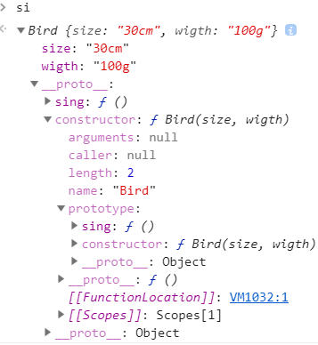

# 原型

函数对象：通过function关键字和Function构造函数创建函数对象，也只有函数对象才拥有prototype。

```js
function f1(){};
var f2 = function(){};
var f3 = new Function('str','console.log(str)');
```

## 构造函数

函数可以作为构造函数使用：首字母大写，区分普通函数。

```js
function Person(name,age){	
		this.name = name;
    this.age = age;
    this.sayName = function(){
        console.log(this.name);
    };
}

var person1 = new Person("Stone", 28, "Software Engineer");
var person2 = new Person("Sophie", 29, "English Teacher");

```



## new操作符

创建一个Person的实例，需要new操作，会经历下面三个步骤：

1. 一个继承自Person.prototype的对象被创建

   ```js
   const lisi = Object.create(constructor.prototype)
   ```

2. 使用指定参数调用构造函数，将1.创建的对象作为上下文（new Person 等同于 new Person()不传参）

   ```js
   Person.apply(lisi,arg)
   ```

3. 没有显示返回，则返回1.创建的对象，判断它是否是一个对象，

   ```js
   return lisi；
   ```

构造函数创建对象存在的问题

- person1.sayName和person2.sayName是内存中两块不同的空间，这是浪费。

```js
person1.sayName === person2.sayName
//false
```

- 可以将共同代码提取出来，随之而来的是另一些问题，定义的全局函数只被Person使用，且过多的全局变量或者全局函数的定义会污染全局环境。可以通过prototype来解决

  ```js
    function Person(name, age, job){
        this.name = name;
        this.age = age;
        this.job = job;
        this.sayName = sayName;
    }
    
    function sayName(){
        console.log(this.name);
    }
    
    var person1 = new Person("Stone", 28, "Software Engineer");
    var person2 = new Person("Sophie", 29, "English Teacher");
  ```

  

##   prototype

每一个函数对象都有一个prototype属性，实例可以共享prototype上的属性和方法。

```
function Person(){};
Person.prototype.name = 'ww';
Person.prototype.sayName = function(){
  console.log(this.name)
};

var zs = new Person;
var li = new Person;
console.log(li.sayName())
//zs
console.log(li.sayName === zs.sayName)
//true
```

默认情况下，构造函数的prototype会有一个constructor属性，指向该构造函数的引用。

```js
Person.prototype.constructor === Person
//true
```

- ### 简写原型

在prototype有多个属性和方法时，可以使用简写，避免对戏Person.prototype，但是会丢失constructor属性，此时ls.constructor === Object，即`ls.__proto__.__proto__.constructor === Object`

```
function Person() {};
Person.prototype = {
  name: 'ww',
  sayName: function(){
    console.log(this.name)
  }
}
var ls = new Person

//在重写的原型对象上，加上constructor属性，并指向Person
function Person() {};
Person.prototype = {
	constructor: Person,
  name: 'ww',
  sayName: function(){
    console.log(this.name)
  }
}
```


这种改写prototype的方式会使得constructor属性变为可枚举属性，默认情况下的constructor时不可枚举属性，可以选用Object.defineProperty()

```js
function Person(){}

Person.prototype = {
    name : "Stone",
    age : 28,
    job : "Software Engineer",
    sayName : function () {
        console.log(this.name);
    }
}; 

// 重设构造函数，只适用于 ECMAScript 5 兼容的浏览器
Object.defineProperty(Person.prototype, "constructor", {
    enumerable: false,
    value: Person
});
```


- ### 原型的动态性

  原型查找值的过程是一次搜索，因此在原型对象的修改都可以在实例上反映。但在修改原型对象时情况就不一样了，**在实例化时，会立即给实例添加`__proto__`指向构造函数的prototype，在修改原型对象时，提前实例化时会导致，最初的prototype除了constructor属性之外无其他属性**

  > 实例中的`__proto__`指针仅指向prototype而不是构造函数

  ```js
  function Person() {};
  var ls = new Person;
  Person.prototype.name = 'ls';
  ls.name//ls
  ls.__proto__ 
  //{name:'ls',constructor: Person}
  
  function Person() {};
  var ls = new Person;
  Person.prototype = {
    constructor: Person,
    name: 'ls'
  };
  ls.name//underfinde
  ls.__proto__ 
  //重写之前的prototype
  //{constructor: Person}
  ```

  

- ### 原生对象的原型

  原生对象中也是使用的prototype，所有的应用类型(Object, String, Array)，都是在其构造函数的原型对象上，定义了方法

  > 不建议修改原生对象的prototype、或添加方法

  - Object

  

  - Array

    


- ### 原型对象的问题

  prototype的意义在于共享：

  ```
  function Person() {};
  Person.prototype.friends = ['zs','lisi'];
  var person1 = new Person;
  var person2 = new Person;
  
  person1.friends // ['zs','lisi']
  person2.friends // ['zs','lisi']
  
  person1.friends === person2.friends
  
  person1.friends.push('ww')
  person1.friends // ['zs','lisi','ww']
  person2.friends // ['zs','lisi','ww']
  //这是肯定的，也是必然的
  ```


- ### 构造函数与原型结合

通过实例属性在构造函数定义，所有实例共享的属性和方法在prototype里定义：

```js
function Student(name, age) {
  this.name = name;
  this.age = age;
  this.friends = ['lisi','zs']
}
Student.prototype.study = function() {
  clg('学习中。。。')
}
var si = new Bird('ww',18)
```


## `__proto__`

- `__proto__`浏览器使用，它不是ECMAScript语言规范，但所有的浏览器都实现它了，不过不建议程序中使用。它是一个访问器属性(getter,setter)，暴露它所访问的对象的prototype(或者null)

  >   实例对象   ------(`__proto__`)------>  构造函数的prototype

  ```js
  si.__proto__ === Bird.prototype
  //true
  
  ```


## 原型链继承

将一个构造函数的prototype 设为 另一个构造函数的实例

```js
function Father(name) {
  this.name = 'lisi'; 
}
Father.prototype.say = function(){
  return this.name
}
function Son() {};
Son.prototype = new Father;

//即Son.prototype = {name: 'lisi'};Son丢失了constructor
```


### 原型链的问题

1. 原型链上有引用类型的值，会被所有实例共享

2. 创建子类时不能像父类传参

   ```js
   function Father(name) {
     this.name = ['lisi']; 
   }
   Father.prototype.say = function(){
     return this.name[0]
   }
   function Son() {};
   Son.prototype = new Father;
   
   var p1 = new Son;
   var p2 = new Son;
   
   p1.name === p2.name
   true
   ```


### 确定原型和实例的关系

- **instanceOf**

  原型链上有某个原型，则返回true

  ```js
  var p = new Son;
  p instanceOf Son;//true
  p instanceOf Father;//true
  p instanceOf Object;//true
  ```

- **isPrototypeOf()**


### 借用构造函数(经典继承)

- 优点：解决了引用属性共享问题，也可以向父类传参。
- 缺点：方法都在构造函数里定义，没法共享。

> 在子类的构造函数里调用父类的构造函数

```js
function Father() {
  this.name = ['zs'];
}
Father.prototype.say = function(){
  return this.name[0]
}
function Son() {
  Father.call(this)
};

var p1 = new Son;
var p2 = new Son;
p1.name === p2.name //false
p1.say()//
is not a function
```


### 组合继承

> 借用构造函数继承实例属性，使用原型链继承原型的方法和属性

1. 优点：结合借用构造函数和原型链的优点，即可继承实例属性，也可继承原型
2. 缺点：调用2次父类的构造函数

```js
function Father(name) {
	this.name = name
  this.friends = ['zs','lisi'];
}
Father.prototype.sayName = function(){
  return this.name
}
function Son(name,age) {
  Father.call(this,name)
  this.age = age
};
Son.prototype = new Father;
Son.prototype.sayAge = function(){
  return this.age
}

var p1 = new Son('mek',18);
var p2 = new Son('hhz',20);
```


### 原型继承

基于已有对象，创建新对象。在object函数内部创建临时构造函数，将传入的对象作为临时构造函数的prototype，返回临时构造函数的实例

```js
function object(o) {
  function F(){}
  F.prototype = o
  return new F
}

var person = {
  name: 'zs',
  friends:['lisi','ww']
}

var p1 = object(person);
var p2 = object(person)
```

在 ECMAScript5 中,通过新增 **object.create()** 方法规范化了上面的原型式继承。使创建的新的对象的`__proto__`,为传入的对象。

Object.create(protp,propertiesObject)

只有一个参数

```js
var person = {
  name: 'zs',
  friends:['lisi','ww']
}
var p1 = Object.create(person);
var p2 = Object.create(person)
```

